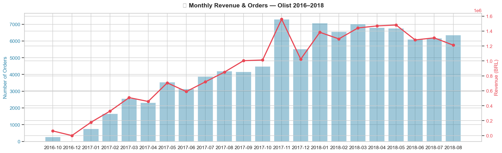
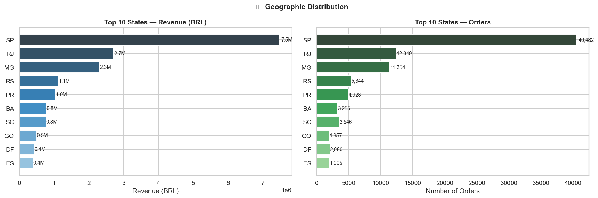
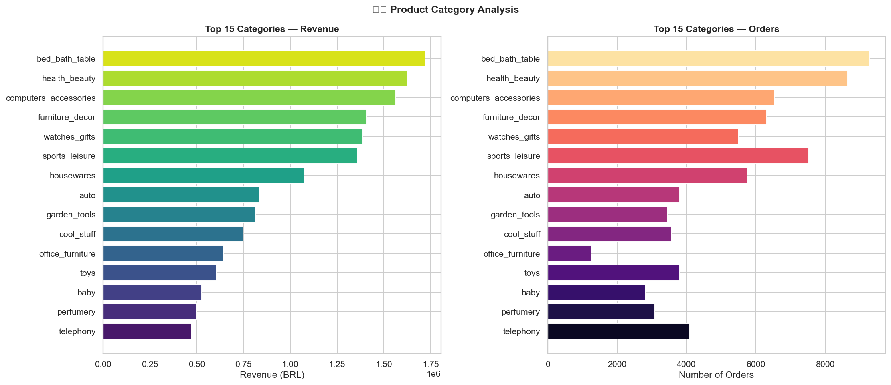
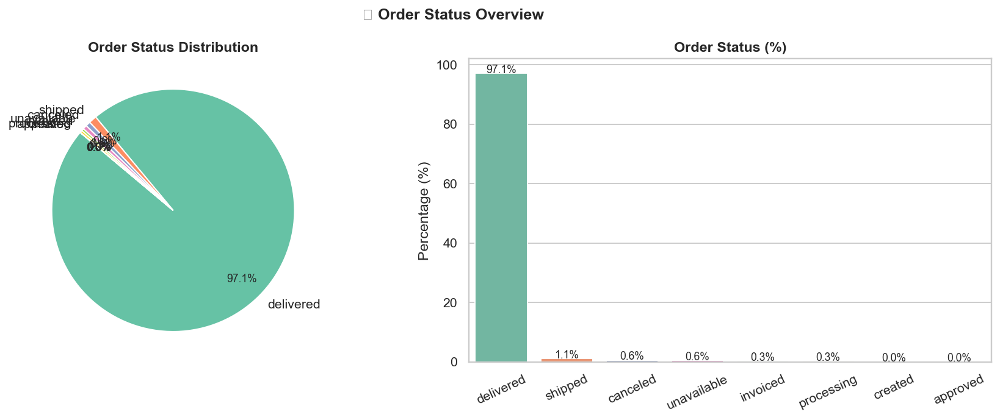
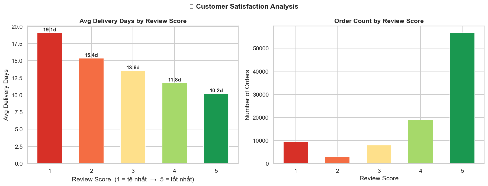
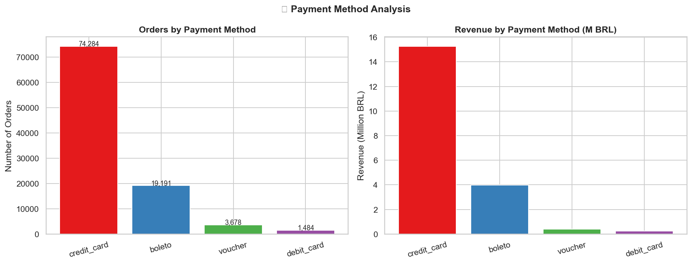
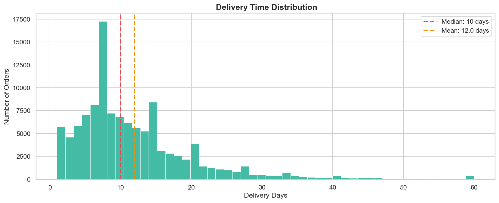
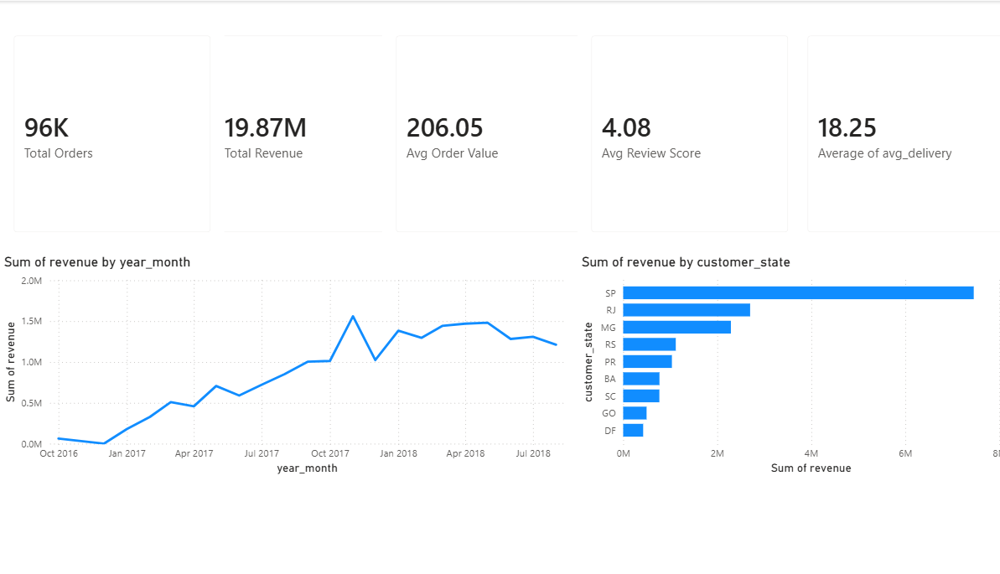
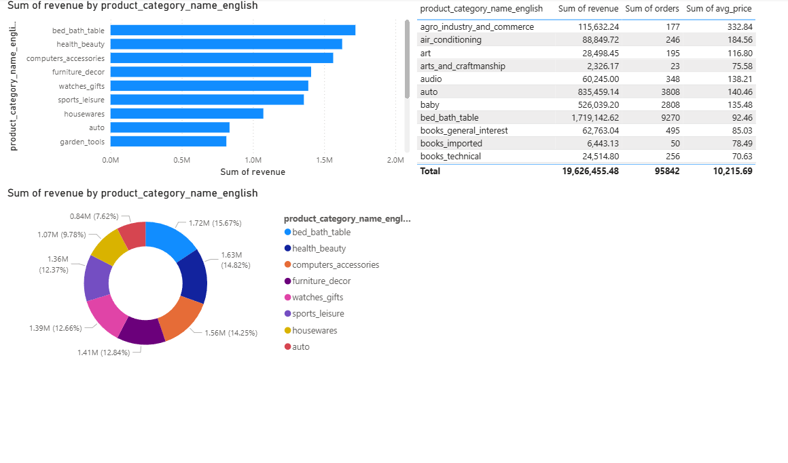
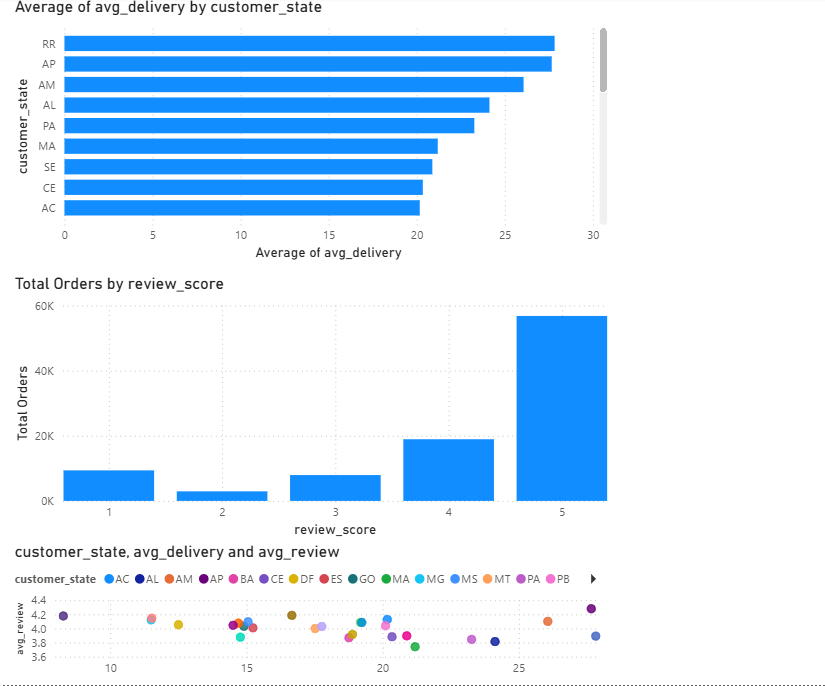

# 🛒 Olist E-Commerce Sales Analysis

> Phân tích toàn diện dữ liệu thương mại điện tử Brazil giai đoạn 2016–2018 sử dụng Python và Power BI.


---

## 📌 Giới thiệu dự án

Dự án này phân tích bộ dữ liệu thực tế từ **Olist** — nền tảng thương mại điện tử lớn nhất Brazil — với hơn **96,000 đơn hàng** trong giai đoạn 2016–2018. Mục tiêu là tìm ra các insight có giá trị về doanh thu, hành vi khách hàng, hiệu suất giao hàng và mức độ hài lòng của người mua.

---

## 📊 Dataset

- **Nguồn:** [Kaggle — Brazilian E-Commerce Public Dataset by Olist](https://www.kaggle.com/datasets/olistbr/brazilian-ecommerce)
- **Thời gian:** Tháng 10/2016 – Tháng 8/2018
- **Quy mô:** 9 bảng dữ liệu liên kết, ~99,000 đơn hàng

---

## 🎯 Mục tiêu phân tích

| # | Mục tiêu | Trạng thái |
|---|---|---|
| 1 | Phân tích xu hướng doanh thu theo thời gian | ✅ Hoàn thành |
| 2 | Xác định các bang và danh mục sản phẩm có hiệu suất cao nhất | ✅ Hoàn thành |
| 3 | Đánh giá mối quan hệ giữa thời gian giao hàng và sự hài lòng của khách hàng | ✅ Hoàn thành |
| 4 | Phân tích phương thức thanh toán phổ biến | ✅ Hoàn thành |
| 5 | Xây dựng dashboard trực quan phục vụ ra quyết định kinh doanh | ✅ Hoàn thành |

---

## 🛠️ Công cụ & Thư viện

| Công cụ | Mục đích |
|---|---|
| Python 3.10 | Xử lý và phân tích dữ liệu |
| Pandas | Load, merge, làm sạch dữ liệu |
| NumPy | Tính toán số học |
| Matplotlib | Vẽ biểu đồ cơ bản |
| Seaborn | Visualization nâng cao |
| Power BI | Dashboard tương tác |
| VS Code + Jupyter | Môi trường phát triển |

---

## 📁 Cấu trúc dự án

```
olist_eda/
├── Chart/                           ← Toàn bộ biểu đồ phân tích EDA
│   ├── chart_01_monthly.png
│   ├── chart_02_states.png
│   ├── chart_03_categories.png
│   ├── chart_04_status.png
│   ├── chart_05_reviews.png
│   ├── chart_06_payment.png
│   └── chart_07_delivery.png
├── data/                            ← Dataset gốc từ Kaggle + file export Power BI
│   ├── olist_orders_dataset.csv
│   ├── olist_order_items_dataset.csv
│   ├── olist_order_payments_dataset.csv
│   ├── olist_order_reviews_dataset.csv
│   ├── olist_customers_dataset.csv
│   ├── olist_sellers_dataset.csv
│   ├── olist_products_dataset.csv
│   ├── olist_geolocation_dataset.csv
│   ├── product_category_name_translation.csv
│   ├── powerbi_main.csv
│   ├── powerbi_monthly.csv
│   ├── powerbi_state.csv
│   └── powerbi_category.csv
├── image/
├── Delivery&Satisfaction.png        ← Power BI Dashboard — Trang 3
├── overview_dashboard.png           ← Power BI Dashboard — Trang 1
├── Product_Analysis.png             ← Power BI Dashboard — Trang 2
├── Olist_EDA.ipynb                  ← Notebook phân tích chính
├── theory_olist_eda.md
└── README.md
```

---

## 🚀 Hướng dẫn chạy

```bash
# 1. Clone repo
git clone https://github.com/trantanphat0811/olist_eda.git
cd olist_eda

# 2. Tạo môi trường Conda
conda create -n olist-eda python=3.10
conda activate olist-eda

# 3. Cài thư viện
pip install pandas numpy matplotlib seaborn jupyter ipykernel

# 4. Tải dataset từ Kaggle vào thư mục data/
# https://www.kaggle.com/datasets/olistbr/brazilian-ecommerce

# 5. Chạy notebook
jupyter notebook Olist_EDA.ipynb
```

---

## 🔍 Quy trình phân tích (EDA)

### Bước 1 — Load & Khám phá dữ liệu

- Load 9 file CSV gốc
- Kiểm tra cấu trúc và missing values từng bảng

### Bước 2 — Làm sạch & Merge

- Chuyển đổi kiểu dữ liệu datetime
- Merge 9 bảng thành 1 dataframe tổng
- Lọc chỉ giữ đơn hàng đã giao thành công (`status = delivered`)
- Tạo các cột phân tích: `year_month`, `delivery_days`, `weekday`

### Bước 3 — Phân tích & Visualization

7 góc phân tích, mỗi góc tương ứng 1 chart (xem chi tiết bên dưới).

### Bước 4 — Export & Dashboard

- Export 4 file CSV sạch cho Power BI
- Xây dựng Dashboard 3 trang trong Power BI

---

## 📈 Charts — Phân tích & Giải thích

Toàn bộ 7 biểu đồ được lưu trong thư mục `charts/`, kèm mô tả chức năng và insight rút ra từ mỗi chart.

---

### Chart 01 — Doanh thu theo tháng (Monthly Revenue Trend)

> 🎯 **Thực hiện mục tiêu #1:** Phân tích xu hướng doanh thu theo thời gian



**Chức năng:** Line chart thể hiện tổng doanh thu (BRL) theo từng tháng từ 2016 đến 2018. Đây là chart **tổng quan nhất** của toàn bộ dự án — cho thấy xu hướng tăng trưởng và các điểm bất thường theo thời gian.

**Vì sao cần chart này?**
Trước khi đi sâu vào bất kỳ phân tích nào, cần hiểu tổng thể business đang tăng hay giảm. Chart này trả lời câu hỏi: *"Olist đang phát triển như thế nào theo thời gian?"*

**Insight rút ra:**

- Doanh thu tăng trưởng đều từ Q1/2017, đạt đỉnh vào **Q4/2017** (Tháng 11 — mùa mua sắm cuối năm)
- Có sự sụt giảm nhẹ đầu 2018 trước khi phục hồi trở lại
- Tổng cộng **~19.87M BRL** trong vòng 2 năm

---

### Chart 02 — Doanh thu theo Bang (Revenue by State)

> 🎯 **Thực hiện mục tiêu #2:** Xác định các bang có hiệu suất cao nhất



**Chức năng:** Bar chart nằm ngang xếp hạng 27 bang của Brazil theo tổng doanh thu. Cho thấy sự **tập trung địa lý** của thị trường E-commerce tại Brazil.

**Vì sao cần chart này?**
Không phải mọi bang đều đóng góp như nhau. Xác định được bang nào là thị trường trọng điểm giúp Olist ưu tiên đầu tư logistics, marketing và mở rộng hệ thống phân phối.

**Insight rút ra:**

- **São Paulo (SP)** chiếm ~40% tổng doanh thu — gần gấp đôi bang đứng thứ 2
- Top 3: **SP → RJ → MG** — tập trung hoàn toàn ở vùng Đông Nam
- Các bang phía Bắc (RR, AP, AC) đóng góp rất nhỏ → tiềm năng mở rộng còn rất lớn

---

### Chart 03 — Top 15 Danh mục Sản phẩm (Product Categories)

> 🎯 **Thực hiện mục tiêu #2:** Xác định các danh mục sản phẩm có hiệu suất cao nhất



**Chức năng:** Bar chart so sánh doanh thu của 15 danh mục sản phẩm bán chạy nhất. Giúp xác định **portfolio sản phẩm nào đang drive revenue** cho platform.

**Vì sao cần chart này?**
Trong E-commerce, không phải category nào cũng đóng góp như nhau. Biết được đâu là category ngôi sao giúp tối ưu inventory, chiến lược promotion và thu hút seller phù hợp.

**Insight rút ra:**

- **bed_bath_table** dẫn đầu về doanh thu
- **health_beauty** và **computers_accessories** lọt top 3
- Có khoảng cách lớn giữa top 3 và phần còn lại → chiến lược "focus vào winner" có thể hiệu quả hơn dàn trải đều

---

### Chart 04 — Phân bổ Trạng thái Đơn hàng (Order Status Distribution)

> 📌 **Chart bổ sung:** Đo lường chất lượng vận hành tổng thể của platform



**Chức năng:** Pie chart hoặc bar chart thể hiện tỷ lệ các trạng thái đơn hàng (delivered, shipped, canceled, unavailable...). Đây là chart **đo lường chất lượng vận hành** của toàn platform.

**Vì sao cần chart này?**
Tỷ lệ đơn hàng không giao thành công (canceled, unavailable) phản ánh trực tiếp trải nghiệm khách hàng và phần doanh thu bị mất. Đây là baseline bắt buộc trước khi đi vào phân tích chuyên sâu hơn.

**Insight rút ra:**

- Đại đa số đơn hàng ở trạng thái `delivered` → platform hoạt động ổn định
- Tỷ lệ `canceled` cần được theo dõi chi tiết theo category để tìm nguyên nhân gốc rễ

---

### Chart 05 — Review Score vs Thời gian Giao hàng (Delivery Time Impact)

> 🎯 **Thực hiện mục tiêu #3:** Đánh giá mối quan hệ giữa thời gian giao hàng và sự hài lòng của khách hàng



**Chức năng:** Bar chart hoặc grouped chart thể hiện mối quan hệ giữa số ngày giao hàng và điểm review trung bình của khách hàng. Đây là **insight quan trọng nhất** của toàn dự án về customer experience.

**Vì sao cần chart này?**
Delivery time là yếu tố nằm trong tầm kiểm soát của Olist và seller. Nếu có bằng chứng rõ ràng rằng giao hàng chậm làm giảm review, đây là actionable insight có thể triển khai ngay.

**Insight rút ra:**

- Đơn giao **< 5 ngày**: ~70% khách cho **5 sao**
- Đơn giao **> 20 ngày**: review score trung bình chỉ **2.8/5**
- Mối quan hệ nghịch chiều rõ ràng: giao hàng càng chậm → satisfaction càng thấp
- **Ngưỡng critical ~10 ngày:** Vượt qua mốc này, điểm review bắt đầu giảm mạnh

---

### Chart 06 — Phương thức Thanh toán (Payment Methods)

> 🎯 **Thực hiện mục tiêu #4:** Phân tích phương thức thanh toán phổ biến



**Chức năng:** Pie chart hoặc bar chart thể hiện tỷ lệ các phương thức thanh toán được sử dụng (credit card, boleto, voucher, debit card). Cho thấy **hành vi tài chính** của người mua Brazil.

**Vì sao cần chart này?**
Hiểu phương thức thanh toán phổ biến giúp Olist ưu tiên tối ưu checkout flow, đàm phán phí với payment provider, và thiết kế chương trình khuyến mãi phù hợp (VD: cashback riêng cho credit card).

**Insight rút ra:**

- **Credit card** chiếm ~74% — phương thức chủ đạo, cần ưu tiên tối ưu trải nghiệm checkout
- **Boleto** (~19%) — phương thức tiền mặt đặc trưng của Brazil, quan trọng với nhóm khách hàng chưa có tài khoản ngân hàng
- **Voucher & Debit card** chiếm thiểu số — cần đánh giá ROI trước khi đầu tư thêm

---

### Chart 07 — Phân phối Thời gian Giao hàng (Delivery Time Distribution)

> 🎯 **Thực hiện mục tiêu #3:** Đánh giá mối quan hệ giữa thời gian giao hàng và sự hài lòng của khách hàng



**Chức năng:** Histogram hoặc KDE plot thể hiện phân phối số ngày giao hàng trên toàn bộ đơn hàng. Cho thấy **hình dạng thực tế của delivery performance** — không chỉ dừng lại ở con số trung bình.

**Vì sao cần chart này?**
Con số trung bình (~18 ngày) có thể che giấu outliers nguy hiểm. Chart này cho thấy bao nhiêu % đơn hàng giao nhanh và bao nhiêu % giao rất chậm — thông tin thiết yếu để đặt ra SLA target thực tế.

**Insight rút ra:**

- Phân phối lệch phải (right-skewed) — đa số đơn giao trong 5–15 ngày, nhưng có đuôi dài với nhiều đơn trễ nghiêm trọng
- Các bang phía Bắc (RR, AP, AM) kéo đuôi phải lên đáng kể, trung bình **25–30 ngày**
- Đây là bằng chứng cho thấy cần cải thiện logistics tại các bang xa trung tâm

---

## 📊 Power BI Dashboard

> 🎯 **Thực hiện mục tiêu #5:** Xây dựng dashboard trực quan phục vụ ra quyết định kinh doanh

Dashboard gồm 3 trang, ảnh preview lưu trong thư mục `image/`:

| Trang | Nội dung | Thực hiện mục tiêu |
|---|---|---|
| Overview | 5 KPI Cards + Line Chart doanh thu + Bar Chart Top 10 States | #1, #2 |
| Product Analysis | Bar Chart Top 15 Categories + Table + Donut Chart | #2 |
| Delivery & Satisfaction | Bar Chart Delivery by State + Column Chart Review + Scatter Chart | #3 |

**Preview Dashboard:**







---

## 💡 Insights chính

### 📈 Doanh thu

- Tổng doanh thu đạt **~19.87M BRL** trong 2 năm
- Doanh thu tăng trưởng mạnh từ **Q1/2017**, đạt đỉnh vào **Q4/2017**
- Trung bình mỗi đơn hàng đạt **206 BRL**

### 🗺️ Địa lý

- **São Paulo (SP)** chiếm ~40% tổng doanh thu toàn quốc
- Top 3 bang: **SP → RJ → MG** — tập trung ở vùng Đông Nam Brazil
- Các bang vùng Bắc (RR, AP, AM) có thời gian giao hàng dài nhất (~25–30 ngày)

### 🛍️ Sản phẩm

- **bed_bath_table** là danh mục dẫn đầu về doanh thu
- **health_beauty** và **computers_accessories** nằm trong top 3
- Có sự chênh lệch giữa doanh thu và số lượng đơn theo từng danh mục

### 🚚 Giao hàng & Hài lòng

- Thời gian giao hàng trung bình: **~18 ngày**
- Bang giao hàng **càng nhanh → review score càng cao**
- Đơn hàng giao dưới 5 ngày có **70% khách cho 5 sao**
- Đơn hàng giao trên 20 ngày có review score trung bình chỉ **~2.8/5**

### 💳 Thanh toán

- **Credit card** chiếm ~74% tổng giao dịch
- **Boleto** (thanh toán tiền mặt) đứng thứ 2 với ~19%

---

## 📝 Kết luận & Bài học rút ra

### Tổng kết dự án

Dự án phân tích thành công toàn bộ vòng đời của một đơn hàng E-commerce — từ lúc đặt hàng đến khi giao và được đánh giá — trên nền tảng Olist với dữ liệu thực tế 2 năm. Ba phát hiện quan trọng nhất:

**1. Delivery time là đòn bẩy lớn nhất để cải thiện customer satisfaction.**
Dữ liệu cho thấy mối quan hệ trực tiếp và đo lường được giữa tốc độ giao hàng và điểm review. Đây không phải giả thuyết — đây là bằng chứng từ hàng chục nghìn đơn hàng thực tế. Nếu Olist muốn tăng rating, cải thiện logistics là ưu tiên số 1, đặc biệt tại các bang phía Bắc nơi thời gian giao hàng đang ở mức 25–30 ngày.

**2. Thị trường Brazil phân bổ không đều — São Paulo là trọng điểm nhưng cũng là rủi ro.**
40% doanh thu đến từ 1 bang duy nhất. Đây vừa là cơ hội (tập trung nguồn lực hiệu quả) vừa là rủi ro tập trung (nếu SP sụt giảm, toàn platform bị ảnh hưởng nặng). Các bang phía Bắc vừa có delivery time dài nhất, vừa có doanh thu thấp nhất — logistics yếu kém đang trực tiếp cản trở tăng trưởng tại những khu vực tiềm năng này.

**3. Credit card chiếm 74% — nhưng Boleto 19% không thể bỏ qua.**
Boleto là phương thức đặc trưng cho nhóm khách hàng chưa có tài khoản ngân hàng (unbanked) — một phân khúc lớn tại Brazil. Cắt giảm hỗ trợ Boleto để ưu tiên tối ưu credit card flow có thể vô tình loại bỏ ~1/5 lượng giao dịch hiện tại.

---

### Kỹ năng thực hành được qua dự án

| Kỹ năng | Áp dụng cụ thể |
|---|---|
| **Data Wrangling** | Merge 9 bảng CSV, xử lý missing values, datetime conversion |
| **EDA Systematic** | 7 góc phân tích có cấu trúc, không phân tích ngẫu nhiên |
| **Visualization** | Chọn đúng chart type cho từng loại câu hỏi (trend → line, comparison → bar, distribution → histogram) |
| **ETL Pipeline** | Tự động hóa từ raw CSV → clean data → Power BI ready |
| **Business Thinking** | Translate số liệu thành insight có thể hành động (actionable insights) |
| **Dashboard Design** | Phân tầng thông tin theo 3 page: Overview → Product → Delivery |

---

### Hướng phát triển tiếp theo

- **RFM Segmentation:** Phân loại khách hàng theo Recency, Frequency, Monetary để xây dựng chiến lược retention có mục tiêu → [Xem dự án tiếp theo](https://github.com/trantanphat0811/rfm-segmentation)
- **Churn Prediction:** Dùng Machine Learning để dự báo khách hàng nào có nguy cơ rời bỏ platform
- **Delivery Time Forecasting:** Xây dựng model dự báo thời gian giao hàng dựa trên bang, danh mục và seller — giúp set expectation chính xác cho khách hàng ngay từ lúc đặt hàng
- **Seller Performance Analysis:** Phân tích hiệu suất từng seller để xác định top performers và những sellers cần hỗ trợ cải thiện

---

## 👤 Tác giả

**Trần Tấn Phát**

- 📧 trantanphat08112004@gmail.com
- 🎓 Sinh viên Công nghệ Dữ liệu — Đại học Văn Lang
- 💼 GitHub: [github.com/trantanphat0811](https://github.com/trantanphat0811)

---

## 📄 License

Dataset thuộc sở hữu của [Olist](https://olist.com/) và được công bố công khai trên Kaggle theo giấy phép **CC BY-NC-SA 4.0**.
